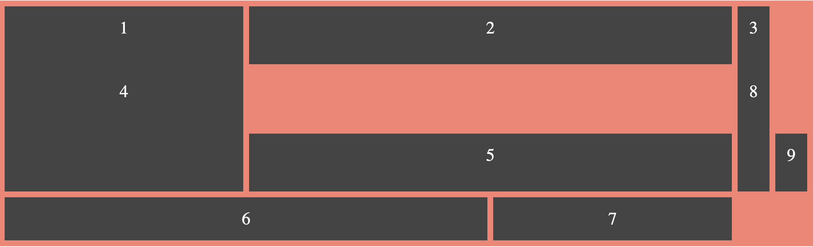
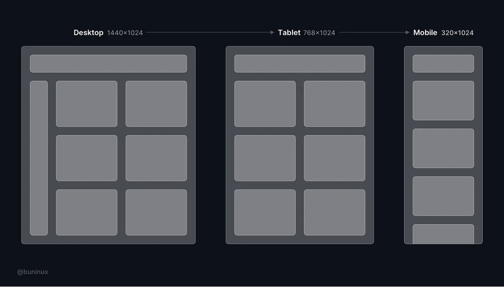

# Grid Practice

## Activity 1:

Recreate this Image only using `grid-columns` and `grid-rows`


## Activity 2:

You are creating your new Web Developer Portfolio and it has the structure that looks similar to this:


### Instructions:
1. Create a new HTML file and add a container element with the class `portfolio-container`.

2. Add 8 child elements with the class `portfolio-item`.

3. Define the layout of your personal portfolio using `grid-template-areas`. Your portfolio should have:

* A header area (header)
* A content area (content)
* A sidebar area (sidebar)
* A footer area (footer)
* Responsive Layout (Desktop, Tablet, Mobile view)

Here's an example `grid-template-area` for a 3x3 portfolio:

```css
.portfolio-container {
  display: grid;
  grid-template-areas:
    "header header header"
    "nav content sidebar"
    "personal personal personal"
    "footer footer footer";
  grid-template-columns: repeat(3, 1fr);
  grid-template-rows: auto 1fr auto auto;
  grid-gap: 10px;
  padding: 20px;
  background-color: #fff;
}
```

4. Use `grid-area` to position each of the child elements within the grid. You can choose any size and aspect ratio for each of the items.

Here's an example of how you could position the items:
```css
.portfolio-item {
  background-color: #444;
  color: #fff;
  padding: 20px;
  font-size: 30px;
  text-align: center;
}

.header {
  grid-area: header;
}

.nav {
  grid-area: nav;
}

.content {
  grid-area: content;
}

.sidebar {
  grid-area: sidebar;
}

.footer {
  grid-area: footer;
}

.personal {
  grid-area: personal;
}

```
